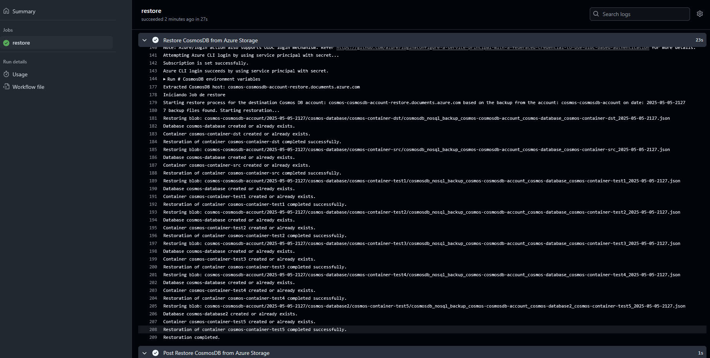

# Backup CosmosDB GitHub Action


This GitHub Action automates the process of backing up a CosmosDB database to Azure Storage. It is designed to run on a schedule or be triggered manually via the `workflow_dispatch` event.

## backup Workflow Example Overview

- **Name**: Backup CosmosDB
- **Triggers**:
    - Scheduled as a cron job.
    - Can also be triggered manually.
    - Runs on the `main` branch upon push events.

## Inputs for Backup Action

The following inputs are required for the backup action:

- **Azure Credentials**:
    - `AZURE_CREDENTIALS`: Azure credentials stored as a GitHub secret.
    - `ARM_CLIENT_ID`: Azure Resource Manager client ID.
    - `ARM_CLIENT_SECRET`: Azure Resource Manager client secret.
    - `ARM_SUBSCRIPTION_ID`: Azure subscription ID.
    - `ARM_TENANT_ID`: Azure tenant ID.

- **CosmosDB Configuration**:
    - `COSMOS_ENDPOINT`: The endpoint URL of the CosmosDB account.
    - `COSMOS_KEY`: The primary key for the CosmosDB account.
    - `DATABASE_NAME`: The name of the CosmosDB database to back up.
    - `CONTAINER_NAME`: The name of the CosmosDB container to back up.

- **Azure Storage Configuration**:
    - `STORAGE_ACCOUNT_NAME`: The name of the Azure Storage account where the backup will be stored.
    - `STORAGE_CONTAINER`: The name of the Azure Storage container for the backup.

- **Resource Group**:
    - `RESOURCE_GROUP`: The name of the Azure resource group containing the CosmosDB account.

- **Action**:
    - `action`: Specifies the operation to perform. In this case, it is set to `"backup"`.
    - **Restore Action**: The restore functionality is not yet implemented. This feature is planned for future development to allow restoring data from Azure Storage back to a CosmosDB database.

## Usage

To use this workflow, ensure that all required secrets are configured in your GitHub repository settings. The workflow will automatically back up the specified CosmosDB database to the designated Azure Storage container.

## Example Workflow File

Below is an example of a GitHub Actions workflow file to back up a CosmosDB database:

```yaml
name: Backup CosmosDB

on:
    workflow_dispatch:
    schedule:
        - cron: "0 2 * * *" # Every day at 2 AM UTC
    push:
        branches:
            - main

jobs:
    backup:
        runs-on: ubuntu-latest

        steps:
            - name: Checkout repo
                uses: actions/checkout@v4

            - name: Backup CosmosDB to Azure Storage
                uses: ./.github/actions/cosmosdb-backup
                with:
                    AZURE_CREDENTIALS: ${{ secrets.AZURE_CREDENTIALS }}
                    ARM_CLIENT_ID: ${{ secrets.ARM_CLIENT_ID }}
                    ARM_CLIENT_SECRET: ${{ secrets.ARM_CLIENT_SECRET }}
                    ARM_SUBSCRIPTION_ID: ${{ secrets.ARM_SUBSCRIPTION_ID }}
                    ARM_TENANT_ID: ${{ secrets.ARM_TENANT_ID }}
                    COSMOS_ENDPOINT: "https://cosmos-cosmosdb-account.documents.azure.com:443" #$${{ secrets.COSMOS_ENDPOINT }}
                    COSMOS_KEY: ${{ secrets.COSMOS_KEY }}
                    CONTAINER_NAME: "cosmos-container-src"
                    DATABASE_NAME: "cosmos-database"
                    RESOURCE_GROUP: "cosmos-resources"
                    STORAGE_ACCOUNT_NAME: "cosmosbkp1123"
                    STORAGE_CONTAINER: "cosmos-backup-container"
                    SUBSCRIPTION_ID: ${{ secrets.AZURE_SUBSCRIPTION_ID }}
                    action: "backup" # "full_backup" to backup all databases and containers.
```

the composite action runs a python script that performs a backup of Cosmos DB containers and stores the data in Azure Blob Storage. 
The backup files are saved locally in a structured directory and after use azure cli to uploaded to Azure Storage.

### How to Locate the Backup File:
1. **Backup Directory Structure**:
    - The backup files are stored in a directory structure based on the Cosmos DB account name, database name, and container name.
    - Example directory structure:
      ```
      ./backup/{cosmos_account_name}/{timestamp}/{database_name}/{container_name}/
      ```
      - `cosmos_account_name`: Extracted from the `COSMOS_ENDPOINT` environment variable.
      - `timestamp`: The current date and time in the format `YYYY-MM-DD-HHMM`.
      - `database_name`: The name of the Cosmos DB database being backed up.
      - `container_name`: The name of the container within the database.


    

    > in this image you can see the path sctructure and the json file name

    2. **Backup File Naming**:
        - Each backup file is named using the following pattern:
          ```
          cosmosdb_nosql_backup_{cosmos_account_name}_{database_name}_{container_name}_{timestamp}.json
          ```
          - This ensures that the file name is unique and descriptive.

        **Examples**:
        - `cosmosdb_nosql_backup_mycosmosaccount_mydatabase_mycontainer_2023-03-15-1230.json`
        - `cosmosdb_nosql_backup_testaccount_testdatabase_testcontainer_2023-05-10-1015.json`
        - `cosmosdb_nosql_backup_prodaccount_proddatabase_prodcontainer_2023-07-20-0830.json`

3. **Example Backup File Path**:
    ```
    ./backup/mycosmosaccount/2023-03-15-1230/mydatabase/mycontainer/cosmosdb_nosql_backup_mycosmosaccount_mydatabase_mycontainer_2023-03-15-1230.json
    ```

4. **Backup Content**:
    - The backup file contains all documents from the specified container in JSON format.
    - Each document includes an additional key, `container_name`, to indicate the source container.

### Prerequisites:
- Ensure all required environment variables are set:
  - `COSMOS_ENDPOINT`, `COSMOS_KEY`, `SUBSCRIPTION_ID`, `RESOURCE_GROUP`, `STORAGE_ACCOUNT_NAME`, `STORAGE_CONTAINER`.
- Authenticate with Azure using `DefaultAzureCredential`.

### Notes:
- If the specified Azure Storage Account does not exist, it will be created automatically.
- The script logs the progress and any errors encountered during the backup process.
"""


## Github Restore Script in Composite Actions

This workflow is designed to restore data from Azure Storage to an Azure CosmosDB instance. It utilizes a custom composite action to securely interact with Azure resources and perform the restore operation.


### Configuration
- **Azure Credentials**: Ensure the following secrets are configured in the repository:
    - `AZURE_CREDENTIALS`
    - `ARM_CLIENT_ID`
    - `ARM_CLIENT_SECRET`
    - `ARM_SUBSCRIPTION_ID`
    - `ARM_TENANT_ID`
    - `COSMOS_KEY`
- **CosmosDB Details**: Update the `COSMOS_ENDPOINT`, `CONTAINER_NAME`, `DATABASE_NAME`, and `RESOURCE_GROUP` values as per your CosmosDB instance.
- **Azure Storage Details**: Specify the `STORAGE_ACCOUNT_NAME` and `STORAGE_CONTAINER` for the source of the restore operation.

### Example Workflow
Below is an example of how to configure the restore workflow:

- Ensure that the custom action `.github/actions/cosmosdb-backup` is implemented and available in the repository. Alternatively, replace it with a publicly available action in the format `org/repo@branch` if needed.


### Push and schedule example

```yaml
name: Backup CosmosDB

on:
  workflow_dispatch:
  schedule:
    - cron: "0 2 * * *" # Every day at 2 AM UTC
  push:
    branches:
      - main

jobs:
  full_backup:
    runs-on: ubuntu-latest

    steps:
      - name: Checkout repo
        uses: actions/checkout@v4

      - name: Full Backup CosmosDB to Azure Storage
        uses: ./.github/actions/cosmosdb-backup
        with:
          AZURE_CREDENTIALS: ${{ secrets.AZURE_CREDENTIALS }}
          ARM_CLIENT_ID: ${{ secrets.ARM_CLIENT_ID }}
          ARM_CLIENT_SECRET: ${{ secrets.ARM_CLIENT_SECRET }}
          ARM_SUBSCRIPTION_ID: ${{ secrets.AZURE_SUBSCRIPTION_ID }}
          ARM_TENANT_ID: ${{ secrets.ARM_TENANT_ID }}
          COSMOS_ENDPOINT: "https://cosmos-cosmosdb-account-restore.documents.azure.com:443"
          COSMOS_KEY: ${{ secrets.COSMOS_KEY }}
          CONTAINER_NAME: "cosmos-container-src"
          DATABASE_NAME: "cosmos-database"
          RESOURCE_GROUP: "cosmos-resources"
          STORAGE_ACCOUNT_NAME: "cosmosbkp1123"
          STORAGE_CONTAINER: "cosmos-backup-container"
          action: "full_restore"
```


### Push and Manual Trigger Example 

```
name: 🌌 Backup and Restore CosmosDB

on:
  push:
    branches:
      - main
  workflow_dispatch:
    inputs:
      timestamp:
        description: "Timestamp for the backup to restore"
        required: true
        default: "2025-05-05-2127"
      action:
        description: "Action to perform (e.g., full_restore)"
        required: true
        default: "full_restore"
      cosmos_db_source_account:
        description: "Source Cosmos DB account name"
        required: true
        default: "cosmos-cosmosdb-account"
      cosmos_endpoint:
        description: "Destination Cosmos DB endpoint"
        required: true
        default: "https://cosmos-cosmosdb-account-restore.documents.azure.com:443"
      storage_account_name:
        description: "Azure Storage Account Name"
        required: true
        default: "cosmosbkp1123"
      storage_container:
        description: "Azure Storage Container Name"
        required: true
        default: "cosmos-backup-container"
      resource_group:
        description: "Resource Group Name"
        required: true
        default: "cosmos-resources"

jobs:
  restore:
    runs-on: ubuntu-latest

    steps:
      - name: Checkout repo
        uses: actions/checkout@v4

      - name: Restore CosmosDB from Azure Storage
        uses: ./.github/actions/cosmosdb-restore
        with:
          COSMOS_DB_SOURCE_ACCOUNT: ${{ inputs.cosmos_db_source_account }}
          COSMOS_ENDPOINT: ${{ inputs.cosmos_endpoint }}
          COSMOS_KEY: ${{ secrets.RESTORE_KEY }}
          STORAGE_ACCOUNT_NAME: ${{ inputs.storage_account_name }}
          STORAGE_CONTAINER: ${{ inputs.storage_container }}
          STORAGE_ACCOUNT_KEY: ${{ secrets.STORAGE_ACCOUNT_KEY }}
          RESOURCE_GROUP: ${{ inputs.resource_group }}
          ARM_CLIENT_ID: ${{ secrets.ARM_CLIENT_ID }}
          ARM_CLIENT_SECRET: ${{ secrets.ARM_CLIENT_SECRET }}
          ARM_SUBSCRIPTION_ID: ${{ secrets.AZURE_SUBSCRIPTION_ID }}
          ARM_TENANT_ID: ${{ secrets.ARM_TENANT_ID }}
          TIMESTAMP: ${{ inputs.timestamp }}
          AZURE_CREDENTIALS: ${{ secrets.AZURE_CREDENTIALS }}
          action: ${{ inputs.action }}

```

### Desired Output

After running the GitHub Action, you can verify the successful execution and inspect the output directly in the GitHub Actions logs.

### Example Output Image

Below is an example of how the output might look in the GitHub Actions interface:



This image represents the logs and status of the backup process, including steps such as repository checkout, authentication, and the actual backup operation. Replace the placeholder image with a screenshot of your workflow's execution for better clarity.


### How to Locate Backup Files in Azure Storage

The backup files generated by the script are stored in the **Azure Storage Account** specified in the workflow. Below is a guide on how to locate these files:

### Steps to Locate Backup Files

1. **Access Azure Portal**:
 - Navigate to the **Storage Account** configured in the workflow (`STORAGE_ACCOUNT_NAME`).

2. **Find the Container**:
 - Inside the Storage Account, go to the **Containers** section.
 - Locate the container specified in the workflow (`STORAGE_CONTAINER`).

3. **Browse the Directory Structure**:
 - Inside the container, you will find directories organized by:
   - CosmosDB account name (`cosmos-account-name`).
   - Date and time of the backup (`YYYY-MM-DD-HHMM`).
   - Database name (`database-name`).
   - Container name (`container-name`).

4. **Locate the Backup File**:
 - Inside the container's directory, you will find the backup file with the following naming convention:
   ```
   cosmosdb_nosql_backup_<cosmos-account-name>_<database-name>_<container-name>_<timestamp>.json
   ```


## Running the Backup Script Locally

If you want to run the backup process locally without using GitHub Actions, you can execute the script manually by following these steps after clone the repo:

### Prerequisites

1. **Python Environment**:
   - Ensure you have Python 3.8 or later installed on your machine.
   - Install the required Python packages by running:
     ```bash
     pip install -r requirements.txt
     ```

2. **Azure CLI**:
   - Install and log in to the Azure CLI:
     ```bash
     az login
     ```

3. **Environment Variables**:
   - Set the required environment variables in your terminal. These variables are used by the script to authenticate and configure the backup process.

### Required Environment Variables

Set the following environment variables before running the script:

| Variable Name           | Description                                                                 |
|-------------------------|-----------------------------------------------------------------------------|
| `COSMOS_ENDPOINT`       | The endpoint URL of the CosmosDB account.                                  |
| `COSMOS_KEY`            | The primary key for the CosmosDB account.                                  |
| `CONTAINER_NAME`        | The name of the CosmosDB container to back up.                             |
| `DATABASE_NAME`         | The name of the CosmosDB database to back up.                              |
| `RESOURCE_GROUP`        | The name of the Azure resource group containing the CosmosDB account.       |
| `STORAGE_ACCOUNT_NAME`  | The name of the Azure Storage account where the backup will be stored.      |
| `STORAGE_CONTAINER`     | The name of the Azure Storage container for the backup.                    |
| `SUBSCRIPTION_ID`       | The Azure subscription ID associated with the resources.                   |

### Example: Setting Environment Variables

Run the following commands in your terminal to set the environment variables:

```bash
export COSMOS_ENDPOINT="https://cosmos-cosmosdb-account.documents.azure.com:443/"
export COSMOS_KEY="your-cosmosdb-key"
export CONTAINER_NAME="cosmos-container-src"
export DATABASE_NAME="cosmos-database"
export RESOURCE_GROUP="cosmos-resources"
export STORAGE_ACCOUNT_NAME="cosmosbkp1123"
export STORAGE_CONTAINER="cosmos-backup-container"
export SUBSCRIPTION_ID="your-subscription-id"
```

### Running the Script
Once the environment variables are set, you can run the backup script:

```bash
cd python ./.github/actions/cosmosdb-restore full_restore.py
```

### Support

If you need assistance or have any questions, please contact [rosthan.pereira@eu.com](mailto:rosthan.pereira@eu.com).